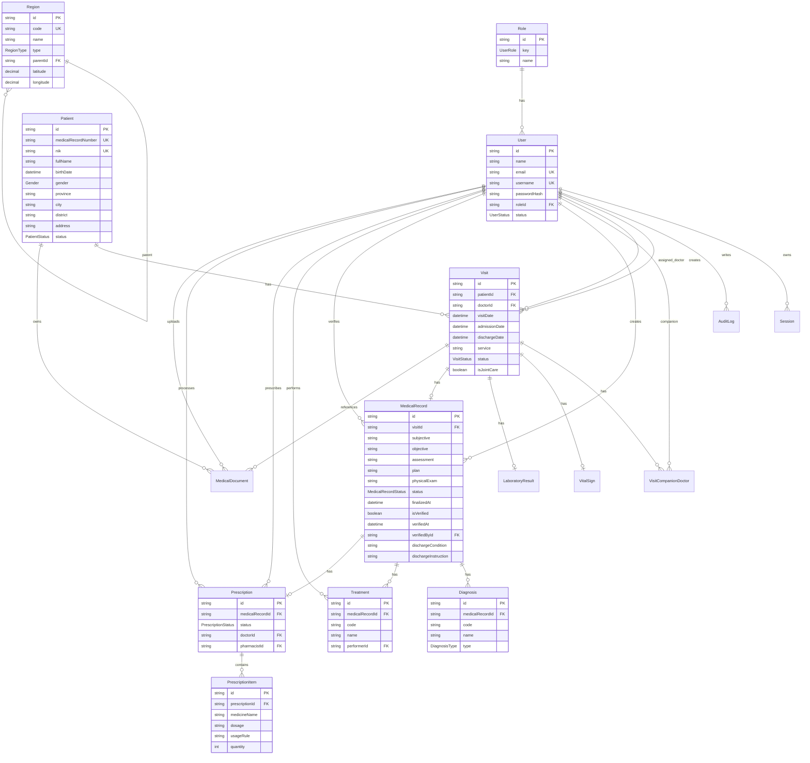

# Developer Documentation

Dokumen ini menjelaskan struktur teknis aplikasi Rekam Medis Elektronik, mapping fitur ke file/fungsi, alur logika, struktur database, relasi, dan ERD. Dokumen ini ditujukan untuk developer yang akan melanjutkan maintenance atau pengembangan fitur.

## Ringkasan Arsitektur

Aplikasi menggunakan Next.js App Router dengan TypeScript, Prisma, PostgreSQL Supabase, dan komponen UI berbasis shadcn/ui + Tailwind CSS.

Alur utama aplikasi:

```text
Landing Page -> Login -> Dashboard
Dashboard -> Pasien -> Kunjungan -> Asesmen -> Laboratorium -> Resep -> CPPT -> Dokumen Medis -> Laporan
```

Pembagian tanggung jawab:

```text
app/                 Routing Next.js, server actions, API route, page shell.
components/          Komponen UI per fitur dan reusable UI.
lib/auth/            Login, session, permission, password, audit helper.
lib/data/clinic.ts   Query server-side untuk semua data fitur utama.
lib/reports/         Utility scope dan export laporan.
lib/*.ts             Helper domain, validation, Prisma client, data ICD.
prisma/              Schema database, migration, seed.
scripts/             Script import/cleanup/seed data operasional.
tests/               Unit test dan Playwright e2e.
```

## Entry Point Aplikasi

| File | Fungsi |
| --- | --- |
| `app/page.tsx` | Landing page publik sebelum login. |
| `app/login/page.tsx` | Halaman login yang fokus pada form autentikasi. |
| `app/login/login-form.tsx` | Client form login, loading dialog, dan error toast. |
| `app/app/page.tsx` | Server page utama setelah login. Mengambil data sesuai permission lalu mengirim ke `MedRecordApp`. |
| `app/medrecord-app.tsx` | Client shell dashboard: sidebar, header, filter dialog, composer dialog, dan render section aktif. |
| `app/template.tsx` | Transisi antar halaman. |
| `app/layout.tsx` | Root layout, theme provider, font, toast provider. |
| `proxy.ts` | Middleware/proxy guard untuk route terproteksi. |

## Role dan Permission

Role aktif hanya 3:

| Role | Akses |
| --- | --- |
| `MASTER` | Semua fitur aplikasi. |
| `ADMIN` | Dashboard, pasien, dan kunjungan. |
| `DOCTOR` | Fitur klinis, laporan, dokumen, dan pengaturan akun. Tidak bisa akses pasien/pendaftaran, manajemen user, dan audit log. |

File utama:

| File | Fungsi |
| --- | --- |
| `lib/auth/permissions.ts` | Matrix permission backend. Digunakan sebelum mengambil data dan sebelum mutasi penting. |
| `lib/medical-data.ts` | Definisi navigation item dan role UI. |
| `tests/permissions.test.ts` | Menjaga permission backend tetap sinkron dengan navigasi. |
| `tests/report-scope.test.ts` | Memastikan scope laporan sesuai role. |

Khusus dokter:

- Dokter hanya melihat/memproses kunjungan yang memanggil dirinya sebagai DPJP atau rawat bersama.
- Logic scope ada di `assignedDoctorVisitWhere()` pada `lib/data/clinic.ts`.
- Validasi mutasi ada di server actions pada `app/actions/clinic.ts`.

## Data Fetching Server-Side

Semua query utama untuk halaman dashboard terkonsentrasi di `lib/data/clinic.ts`.

| Function | Fitur | Logika utama |
| --- | --- | --- |
| `getDashboardSummary()` | Dashboard | Hitung pasien aktif, kunjungan hari ini, kunjungan aktif, dokumen medis, dan antrean layanan. |
| `getPatientList()` | Pasien | Ambil data pasien, ringkasan kunjungan terakhir, alamat terstruktur, dan usia. |
| `getVisitList()` | Kunjungan | Ambil daftar kunjungan, pasien, DPJP, rawat bersama, status alur. |
| `getVisitFormOptions()` | Form kunjungan | Ambil pasien aktif, dokter aktif, dan daftar ruang rawat. |
| `getClinicalWorklist(mode, viewer)` | Asesmen, Lab, CPPT | Mengambil kunjungan yang sudah berada di tahap sesuai mode dan dibatasi scope dokter. |
| `getMedicalRecordHistory(viewer)` | CPPT | Daftar CPPT draft/final, diagnosa, tindakan, resep, dan scope dokter. |
| `getPrescriptionList(viewer)` | Resep | Daftar resep dan item obat manual. |
| `getPrescriptionFormOptions(viewer)` | Form resep | Ambil CPPT/rekam medis yang siap dibuat resep. |
| `getMedicalDocumentList(viewer)` | Dokumen Medis | Ambil CPPT final dengan visit selesai. Termasuk dokumen belum diverifikasi. |
| `getDocumentFormOptions(viewer)` | Dokumen Medis | Opsi pasien/kunjungan untuk metadata dokumen eksternal. |
| `getReportSummary(options)` | Laporan | Ringkasan laporan berdasarkan tanggal. |
| `getReportDetails(options)` | Laporan | Detail diagnosa, tindakan, opsi filter, dan data map diagnosis. |
| `getDiagnosisExportRows(options)` | Export laporan | Output export dengan urutan `Nama`, `Alamat`, `Diagnosa Utama`, `Diagnosa Sekunder`. |
| `getRegionOptions(options)` | Dropdown alamat | Cascading provinsi, kabupaten/kota, kecamatan. |
| `getDiagnosisMapReport(options)` | Laporan map | Agregasi diagnosis berdasarkan kecamatan/kabupaten/kota dan centroid wilayah. |
| `getAuditLogList()` | Audit Log | Ambil aktivitas audit, payload ringkas, IP, user agent. |
| `getUserList()` | Manajemen user | Daftar user dan role. |
| `getRoleOptions()` | Manajemen user | Opsi role aktif. |

## Server Actions

Mutasi data utama ada di `app/actions/clinic.ts`. Semua action memakai validasi Zod, permission check, audit log, dan `revalidatePath("/app")`.

| Function | Fitur | Logika utama |
| --- | --- | --- |
| `createPatientAction()` | Pasien | Buat pasien, generate no RM, validasi NIK 16 digit, telepon angka, alamat terstruktur. |
| `updatePatientAction()` | Pasien | Update seluruh data pasien termasuk alamat dan status. |
| `deactivatePatientAction()` | Pasien | Nonaktifkan pasien tanpa menghapus histori klinis. |
| `createVisitAction()` | Kunjungan | Buat kunjungan, pilih ruang rawat, DPJP, rawat bersama, set status awal `WAITING`. |
| `cancelVisitAction()` | Kunjungan | Batalkan kunjungan aktif. |
| `saveAssessmentAction()` | Asesmen | Simpan tanda vital, diagnosa masuk, riwayat penyakit, ICD-10, ICD-9-CM, lalu status visit naik ke `VITAL_SIGN`. |
| `upsertLaboratoryAction()` | Laboratorium | Simpan/update hasil lab, lalu status visit naik ke `EXAMINATION`. |
| `addPrescriptionItemAction()` | Resep | Buat resep manual dan item obat, lalu status visit naik ke `PHARMACY`. |
| `processPrescriptionAction()` | Resep | Tandai resep diproses oleh user aktif. |
| `cancelPrescriptionAction()` | Resep | Batalkan resep. |
| `saveMedicalRecordAction()` | CPPT | Simpan draft atau finalisasi CPPT. Finalisasi menjadikan visit `COMPLETED`. |
| `verifyMedicalRecordAction()` | Dokumen Medis | Verifikasi resume medis, isi kondisi pulang dan instruksi pulang, simpan verifier dan waktu realtime. |
| `createMedicalDocumentAction()` | Dokumen Medis | Simpan metadata dokumen eksternal. File tidak disimpan untuk menghemat storage. |
| `createUserAction()` | User | Buat user baru, hash password, relasi role. |
| `updateUserAction()` | User | Update profil, email, username, role, dan status. |
| `resetUserPasswordAction()` | User | Reset password user. |
| `deactivateUserAction()` | User | Nonaktifkan user. |

Autentikasi:

| File | Function | Logika |
| --- | --- | --- |
| `app/actions/auth.ts` | `loginAction()` | Validasi username/password, hash session token, set cookie. |
| `app/actions/auth.ts` | `logoutAction()` | Revoke session dan hapus cookie. |
| `app/actions/auth.ts` | `updateAccountAction()` | User mengubah profil akun sendiri. |
| `app/actions/auth.ts` | `changePasswordAction()` | User mengubah password sendiri. |
| `lib/auth/session.ts` | Session helper | Membaca, membuat, revoke, dan validasi session. |
| `lib/auth/password.ts` | Password helper | Hash dan compare password dengan bcrypt. |
| `lib/auth/audit-log.ts` | Audit helper | Menulis audit log untuk aksi penting. |

## Mapping Fitur ke Komponen

| Fitur | Komponen utama | Form/Dialog | Data/action |
| --- | --- | --- | --- |
| Dashboard | `components/dashboard/dashboard-section.tsx` | - | `getDashboardSummary()` |
| Pasien | `components/patients/patients-section.tsx` | `patient-forms.tsx`, `patient-dialog.tsx` | `getPatientList()`, patient actions |
| Kunjungan | `components/visits/visits-section.tsx`, `visits-table.tsx` | `visit-forms.tsx` | `getVisitList()`, visit actions |
| Asesmen | `components/assessment/assessment-section.tsx` | `AssessmentForm` | `getClinicalWorklist()`, `saveAssessmentAction()` |
| Laboratorium | `components/laboratory/laboratory-section.tsx` | `LaboratoryForm` | `getClinicalWorklist()`, `upsertLaboratoryAction()` |
| Resep | `components/prescriptions/prescriptions-section.tsx` | `prescription-forms.tsx`, `prescription-dialogs.tsx` | prescription queries/actions |
| CPPT | `components/medical-records/medical-records-section.tsx` | `MedicalRecordForm`, detail dialog | `getMedicalRecordHistory()`, `saveMedicalRecordAction()` |
| Dokumen Medis | `components/documents/documents-section.tsx` | verification dialog, download action | `getMedicalDocumentList()`, `verifyMedicalRecordAction()` |
| PDF Resume | `app/medical-records/[recordId]/document/route.ts` | HTML preview dan PDF generator | Query record + audit download |
| Laporan | `components/reports/reports-section.tsx`, `diagnosis-map.tsx` | filter/export | report routes dan `getDiagnosisMapReport()` |
| User | `components/users/users-section.tsx` | `user-forms.tsx` | user actions |
| Audit Log | `components/users/audit-section.tsx` | detail payload dialog | `getAuditLogList()` |
| Pengaturan | `components/settings/settings-section.tsx` | `settings-forms.tsx` | account actions |

## Alur Status Layanan

Status `VisitStatus` tidak sekadar label teknis, tetapi menjadi penanda tahap layanan.

| Status DB | Label UI | Tahap berikutnya |
| --- | --- | --- |
| `WAITING` | Proses Asesmen | Asesmen klinis |
| `VITAL_SIGN` | Proses Laboratorium | Input laboratorium |
| `EXAMINATION` | Proses Resep | Pembuatan resep |
| `PHARMACY` | Proses CPPT | Draft/finalisasi CPPT |
| `COMPLETED` | Selesai | Dokumen medis/verifikasi |
| `CANCELLED` | Dibatalkan | Tidak lanjut proses |

Urutan data:

```text
Patient
  -> Visit
    -> VitalSign + Assessment data
    -> LaboratoryResult
    -> MedicalRecord + Diagnosis + Treatment
    -> Prescription + PrescriptionItem
    -> MedicalRecord FINAL
    -> Document preview/download + verification
```

Catatan implementasi:

- Data yang dibuat di satu fitur hanya tampil di fitur tersebut.
- Dropdown fitur berikutnya mengambil data dari tahap sebelumnya.
- Contoh: pasien baru tampil di Data Pasien, tetapi juga muncul sebagai opsi saat membuat Kunjungan.
- CPPT draft tidak masuk Dokumen Medis. Dokumen Medis hanya menampilkan CPPT final dengan visit `COMPLETED`.

## Dokumen Medis dan PDF Resume

File utama: `app/medical-records/[recordId]/document/route.ts`.

Logika:

- Route menerima `recordId`.
- Cek user login dan permission.
- Cek dokter hanya bisa membuka dokumen kunjungan yang memanggil dirinya.
- Ambil pasien, kunjungan, vital sign, laboratorium, diagnosa, tindakan, resep, dan verifier.
- Jika `?download=1`, response berupa PDF.
- Jika tanpa query download, response berupa HTML preview.
- Nomor dokumen memakai format:

```text
RI MM/YYYY/Romawi
```

Contoh:

```text
RI 07/2026/I
```

Nomor romawi dihitung dari urutan rekam medis final yang sudah masuk fitur Dokumen Medis, termasuk yang belum diverifikasi.

Verifikasi:

- Kondisi pulang dan instruksi pulang diisi saat verifikasi.
- Nama pemberi verifikasi dan teks `Telah diverifikasi pada ...` hanya muncul setelah verifikasi.
- Garis tanda tangan tetap tampil meskipun belum diverifikasi.

## Laporan dan Map Diagnosis

File utama:

| File | Fungsi |
| --- | --- |
| `components/reports/reports-section.tsx` | UI filter, card laporan, tabel ringkasan, export. |
| `components/reports/diagnosis-map.tsx` | Client-only Leaflet map dengan marker kasus. |
| `app/reports/diagnosis-map.json/route.ts` | Endpoint JSON map diagnosis. |
| `app/reports/summary.csv/route.ts` | Export CSV. |
| `app/reports/summary.xlsx/route.ts` | Export Excel modern `.xlsx`. |
| `lib/reports/export.ts` | Builder output export. |
| `lib/reports/scope.ts` | Scope akses laporan. |

Output export laporan:

```text
Nama, Alamat, Diagnosa Utama, Diagnosa Sekunder
```

Map diagnosis:

- Basemap: Leaflet + OpenStreetMap.
- Agregasi: Diagnosis -> MedicalRecord -> Visit -> Patient.
- Wilayah utama: kecamatan.
- Fallback: kabupaten/kota.
- Marker menampilkan kasus, pasien, dan list diagnosis + kode.
- Tidak menampilkan data personal pasien di map.

## ICD dan Referensi Klinis

| File | Fungsi |
| --- | --- |
| `lib/icd-procedures-eklaim.ts` | Dataset ICD-9-CM untuk tindakan medis. |
| `lib/icd-diagnoses-eklaim.ts` | Dataset ICD-10 untuk diagnosa utama/sekunder. |
| `scripts/generate-icd-diagnoses.mjs` | Generate dataset ICD-10 dari CSV publik. |
| `lib/clinical-validation.ts` | Validasi input klinis seperti NIK, angka vital sign, telepon, dan golongan darah. |

CSV sumber boleh tetap disimpan sebagai referensi import/generate, tetapi runtime aplikasi memakai file TypeScript hasil generate agar dropdown/search lebih stabil.

## Struktur Database

Database memakai PostgreSQL via Prisma.

### Auth dan Audit

| Model | Tabel | Fungsi |
| --- | --- | --- |
| `Role` | `roles` | Master data role: MASTER, ADMIN, DOCTOR. |
| `User` | `users` | Akun login, role, status, relasi dokter/admin/master. |
| `Session` | `sessions` | Session login berbasis token hash. |
| `AuditLog` | `audit_logs` | Catatan aksi penting, before/after payload, IP, user agent. |

### Master Pasien dan Wilayah

| Model | Tabel | Fungsi |
| --- | --- | --- |
| `Patient` | `patients` | Data pasien, no RM, NIK, alamat terstruktur, status. |
| `Region` | `regions` | Dataset provinsi, kabupaten/kota, kecamatan, centroid map. |

Alamat pasien:

```text
province = Provinsi
city     = Kabupaten/Kota
district = Kecamatan
address  = Detail alamat, termasuk kelurahan/desa, jalan, RT/RW
```

### Kunjungan dan Proses Klinis

| Model | Tabel | Fungsi |
| --- | --- | --- |
| `Visit` | `visits` | Kunjungan pasien, ruang rawat, DPJP, status alur. |
| `VisitCompanionDoctor` | `visit_companion_doctors` | Dokter rawat bersama. |
| `VitalSign` | `vital_signs` | Tanda vital per kunjungan. |
| `LaboratoryResult` | `laboratory_results` | Hasil lab per kunjungan. |
| `MedicalRecord` | `medical_records` | CPPT, status draft/final, verifikasi dokumen medis. |
| `Diagnosis` | `diagnoses` | ICD-10 utama/sekunder per CPPT. |
| `Treatment` | `treatments` | ICD-9-CM tindakan medis per CPPT. |
| `Prescription` | `prescriptions` | Header resep per CPPT. |
| `PrescriptionItem` | `prescription_items` | Item obat manual. |
| `MedicalDocument` | `medical_documents` | Metadata dokumen eksternal. Tidak menyimpan file fisik. |

## Relasi Database

Relasi utama:

```text
Role 1 -> N User
User 1 -> N Session
User 1 -> N AuditLog
Patient 1 -> N Visit
Patient 1 -> N MedicalDocument
Visit 1 -> 0..1 VitalSign
Visit 1 -> 0..1 LaboratoryResult
Visit 1 -> 0..1 MedicalRecord
Visit 1 -> N MedicalDocument
Visit N -> N User melalui VisitCompanionDoctor
MedicalRecord 1 -> N Diagnosis
MedicalRecord 1 -> N Treatment
MedicalRecord 1 -> 0..1 Prescription
Prescription 1 -> N PrescriptionItem
Region 1 -> N Region melalui parent/children
```

Delete behavior penting:

| Relasi | Behavior |
| --- | --- |
| `Session -> User` | Cascade saat user dihapus. |
| `Visit -> Patient` | Restrict, pasien tidak boleh hilang jika ada kunjungan. |
| `VitalSign/Lab/MedicalRecord -> Visit` | Cascade saat visit dihapus. |
| `Diagnosis/Treatment/Prescription -> MedicalRecord` | Cascade saat CPPT dihapus. |
| `PrescriptionItem -> Prescription` | Cascade saat resep dihapus. |
| `MedicalDocument -> Patient` | Cascade saat pasien dihapus. |
| `MedicalDocument -> Visit` | SetNull saat visit dihapus. |
| `User` pada audit/verifier/doctor/pharmacist/uploader | Umumnya SetNull agar histori tetap ada. |

## ERD



## Script Operasional

| Command | Fungsi |
| --- | --- |
| `npm run dev` | Jalankan Next.js development server. |
| `npm run build` | Generate Prisma client dan build production. |
| `npm run typecheck` | Validasi TypeScript. |
| `npm run test` | Unit test. |
| `npm run test:e2e` | Playwright e2e. |
| `npm run db:migrate` | Jalankan migration Prisma dev. |
| `npm run db:seed` | Seed user, role, dan data awal. |
| `npm run db:import-regions` | Import dataset wilayah Indonesia. |
| `npm run db:import-patients` | Import data pasien. |
| `npm run db:clear-patient-data` | Hapus data pasien dan data klinis terkait. |
| `npm run db:clear-clinical-data` | Hapus data klinis tanpa menghapus user dan pasien. |
| `npm run db:prepare-prescriptions` | Buat data workflow sampai resep. |
| `npm run db:prepare-cppt-drafts` | Buat data workflow sampai CPPT draft tanpa finalisasi. |

## Testing yang Perlu Dijaga

| Test | Fokus |
| --- | --- |
| `tests/clinical-validation.test.ts` | Validasi input pasien dan tanda vital. |
| `tests/permissions.test.ts` | Permission role dan navigasi. |
| `tests/report-scope.test.ts` | Scope laporan untuk role. |
| `tests/session.test.ts` | Token session aman dan tidak disimpan raw. |
| `tests/e2e/*.spec.ts` | Flow UI end-to-end untuk auth, admin, klinis, farmasi, pendaftaran. |

Sebelum deploy minimal jalankan:

```bash
npm run typecheck
npm run test
npm run build
```

## Catatan Pengembangan

- Jangan bypass server action untuk mutasi data penting karena audit log dan permission check ada di sana.
- Query list dan dashboard sebaiknya tetap berada di `lib/data/clinic.ts` agar page server tetap tipis.
- Untuk fitur klinis baru, ikuti pola: query option/list di `lib/data/clinic.ts`, mutasi di `app/actions/clinic.ts`, UI di `components/<feature>/`.
- Jangan simpan file medis fisik kecuali storage sudah disiapkan. Saat ini dokumen medis eksternal hanya metadata, sedangkan resume medis dibuat on demand.
- Untuk laporan map, jangan kirim data personal pasien ke marker/popup. Gunakan agregat wilayah.
- Jika mengubah role atau navigation, update `lib/auth/permissions.ts`, `lib/medical-data.ts`, dan test permission.
- Jika mengubah status workflow, cek semua query `getClinicalWorklist()`, dashboard queue, dan server actions yang menaikkan status.
